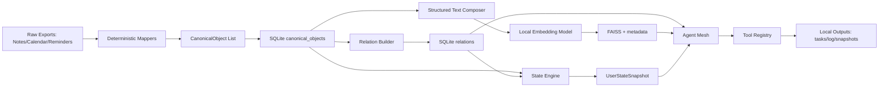

# Architecture Overview

## System Intent

Cortona implements persistent, local-first cognition via deterministic memory construction.  
Probabilistic logic is delayed until after canonical storage and relation linking.

## Layer Responsibilities

- `ingestion`: deterministic source mappers only
- `core`: canonical schema, deterministic IDs, telemetry primitives
- `storage`: SQLite canonical/relations persistence
- `graph`: deterministic relation builder (`SAME_DAY`, `SAME_PERSON`, `SAME_DOMAIN`, `FOLLOW_UP`)
- `embeddings`: structured text vectorization + local FAISS
- `state`: deterministic state derivation from structured signals
- `agents`: event-driven mesh orchestration
- `tools`: local side-effect adapters for agents
- `api`: user-facing orchestration runners

## Runtime Flow

## Determinism Boundaries

- **Deterministic zone**: ingestion, canonical storage, relation building, state scoring, tool dispatch.
- **Probabilistic zone**: embedding generation only, and only after canonical persistence.

## Data Contracts (high-level)

- Canonical object key: `canonical_id` (deterministic hash from source identity).
- Relation key: `(from_canonical_id, to_canonical_id, relation_type)` with deterministic `relation_id`.
- Embedding key: vector row index mapped via metadata `canonical_ids` array.
